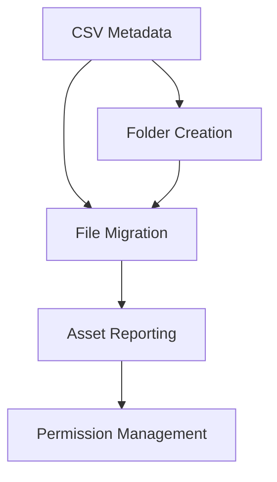

# BestReviews Asset Management - System Patterns

## Architecture Overview

The BestReviews Asset Management system follows a workflow-based architecture with discrete scripts handling specific stages of the asset management process. This structure allows for modular updates and targeted operation execution.

## Core System Patterns

### 1. Pipeline Pattern
The system implements a linear pipeline for asset processing:
- Validate connection and data
- Create target folder structure
- Copy assets to organized structure
- Generate reports
- Manage permissions

Each step is handled by a discrete script that can be run independently or as part of the full workflow.

### 2. Metadata-Driven Organization
Asset organization follows a metadata-driven approach:
- CSV files define the target categorization
- Category/subcategory structure determines folder hierarchy
- File metadata mappings determine final destinations

### 3. Error Isolation
Error handling follows an isolation pattern:
- Failed operations are logged separately
- Success/failure reporting is maintained independently
- Operation continues despite individual failures
- Comprehensive error reporting for post-processing

### 4. Progress Reporting
The system implements progressive feedback:
- Pre-operation counting for progress estimation
- Percentage-based completion tracking
- Performance metrics (objects/second)
- Timestamped reporting for audit trails

### 5. Test-Then-Full Execution
For potentially large-scale operations:
- Test mode allows sampling before full execution
- Random folder selection for representative testing
- Parameter-based control of test scope
- Maintains all reporting capabilities during tests

## Component Relationships

### Connection Scripts
- `wasabi_test.py`: Validates connection and lists bucket contents
  - Used before other operations to ensure connectivity

### Data Validation
- `file_test.py`: Validates CSV metadata format and content
  - Ensures metadata required for organization exists

### Structure Management
- `create_folders.py`: Establishes folder hierarchy
  - Creates empty objects with key patterns ending in '/'
  - Driven by unique category/subcategory combinations

### Content Migration
- `copy_files.py`: Moves assets to organized structure
  - Maps original files to target locations based on metadata
  - Maintains detailed error logging

### Inventory Management
- `br_assets_files.py`: Creates inventory of reorganized files
  - Lists all files in new structure
  - Produces CSV reports

### Permission Management
- `make_objects_public.py`: Updates object ACLs
  - Can operate in test or full mode
  - Maintains comprehensive success/failure tracking
